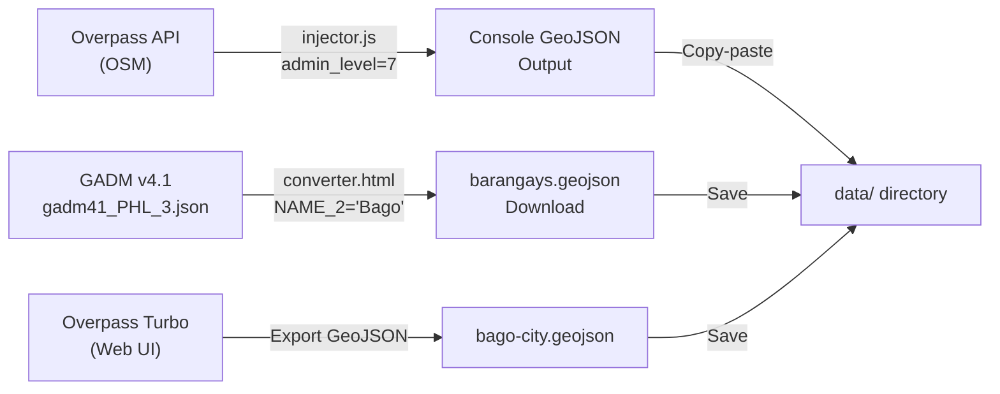

# 📍 Bago City Mapping Prototype — Developer Documentation

> **Core Files:**
> - [`index.html`](file:///c:/mapping/index.html) — Semantic HTML layout structures and third-party CDN mounts
> - [`style.css`](file:///c:/mapping/style.css) — Visual theme design system, dark-glassmorphism panels, and label text shadows
> - [`app.js`](file:///c:/mapping/app.js) — CartoDB tile settings, Turf centroid label injections, and point-in-polygon geolocation checks
> - [`data/bago-city.geojson`](file:///c:/mapping/data/bago-city.geojson) — Live OSM city limit polygon (Overpass-sourced)
> - [`data/barangays.geojson`](file:///c:/mapping/data/barangays.geojson) — GADM-sourced barangay MultiPolygon boundaries
>
> **Utility Files:**
> - [`injector.js`](file:///c:/mapping/injector.js) — Overpass API console injector for fetching OSM barangay boundaries
> - [`converter.html`](file:///c:/mapping/converter.html) — GADM Level 3 JSON file filter & barangay extractor utility
>
> **Version:** 1.3.0
> **Last Updated:** June 24, 2026
> **Stack:** HTML5 · CSS3 · Vanilla JavaScript · [Leaflet.js v1.9.4](https://leafletjs.com/) · [Turf.js v7.3.5](https://turfjs.org/)

---

## Table of Contents

1. [Overview](#1-overview)
2. [Architecture & File Structure](#2-architecture--file-structure)
3. [External Dependencies](#3-external-dependencies)
4. [GIS Data Sources & Pipeline](#4-gis-data-sources--pipeline)
5. [HTML Structure](#5-html-structure)
6. [CSS Design System](#6-css-design-system)
7. [JavaScript — Section-by-Section](#7-javascript--section-by-section)
8. [Turf.js Centroid & Point-in-Polygon Mathematics](#8-turfjs-centroid--point-in-polygon-mathematics)
9. [Dynamic Boundary Lighting Engine](#9-dynamic-boundary-lighting-engine)
10. [Data Utility Tools](#10-data-utility-tools)
11. [Local Hosting & CORS Troubleshooting](#11-local-hosting--cors-troubleshooting)
12. [Responsive Behavior](#12-responsive-behavior)
13. [Customization Reference](#13-customization-reference)
14. [Changelog](#14-changelog)

---

## 1. Overview

This is a modular, high-precision **static prototype** for an interactive mapping application focused on **Bago City, Negros Occidental, Philippines**. The prototype uses a light-themed basemap and utilizes **Turf.js** for client-side spatial calculations.

As of v1.3.0, all geographic boundary data has been upgraded from **mock bounding boxes** to **real-world polygon geometries** sourced from OpenStreetMap (via Overpass API) and the GADM administrative boundaries database. Key features:

- **Asynchronous Data Pipeline**: Mounts and loads `data/bago-city.geojson` and `data/barangays.geojson` concurrently using `Promise.all()` and `fetch()`.
- **CartoDB Positron Basemap**: Light, clean style so that overlay lines draw with maximum visual separation.
- **Real Geographic Boundaries**: Natural polygon shapes sourced from OSM and GADM, replacing the previous rigid square bounding boxes.
- **Official LGU Stylings**:
  - **City Limits**: Solid heavy black dashed line (`color: "#000000"`, `weight: 3`, `dashArray: "6, 4"`).
  - **Barangay Boundaries**: Thin solid gray lines (`color: "#a0a0a0"`, `weight: 1`).
  - **Text-Only Centroid Labels**: Replaces standard Leaflet map pin marker icons with transparent `L.divIcon` text tags. Implements a multi-directional white outline shadow behind the black text labels to maintain legibility over street lines.
- **Dynamic Boundary Lighting Engine**: Captures user GPS coordinates and performs Point-in-Polygon (PIP) checks. It dynamically illuminates matching boundaries with neon indicator layers:
  - **City Limit**: Solid glowing red outline.
  - **Active Barangay**: Bright glowing neon orange outline.
- **Readouts & Fallbacks**: Populates high-contrast sidebar containers with pinpointed location metrics, smoothly centering and zooming inside active regions, or zooming out and raising warnings if coordinate points fall outside Bago City boundaries.
- **Data Utility Tools**: Includes an Overpass API injector script and a GADM file extractor utility for sourcing and converting boundary data.

---

## 2. Architecture & File Structure

The project separates styling, structure, logic, data, and utility files:

```
c:\mapping\
├── data/
│   ├── bago-city.geojson     ← OSM city limit boundary (126 KB, Overpass-sourced)
│   ├── barangays.geojson     ← GADM barangay MultiPolygons (69 KB, 24 features)
│   └── gadm41_PHL_3.json     ← Raw GADM Level 3 source data (23 MB, not loaded by app)
├── index.html                ← Semantic interface and script linkages (161 lines)
├── style.css                 ← Layout, glassmorphism, responsive grids, text shadows (660 lines)
├── app.js                    ← Map setup, data loads, and geocoder PIP math (479 lines)
├── injector.js               ← Overpass API barangay boundary injector IIFE (325 lines)
├── converter.html            ← GADM file filter & barangay extractor utility (134 lines)
└── DOCUMENTATION.md          ← Developer guide (this file)
```

### File Responsibilities

| File | Lines | Size | Description |
|------|-------|------|-------------|
| [`index.html`](file:///c:/mapping/index.html) | 161 | 6 KB | Main HTML entry point — structural nodes (sidebar, stats grid, layer switches, map div) and CDNs |
| [`style.css`](file:///c:/mapping/style.css) | 660 | 13 KB | Core style definitions — dark-glassmorphism, toggle switches, labels, responsive queries |
| [`app.js`](file:///c:/mapping/app.js) | 479 | 16 KB | Application logic — Positron tiles, spatial layers, Turf centroids, geolocation PIP |
| [`injector.js`](file:///c:/mapping/injector.js) | 325 | 11 KB | Overpass API console injector — fetches OSM admin_level=7 relations, outputs GeoJSON |
| [`converter.html`](file:///c:/mapping/converter.html) | 134 | 6 KB | GADM extractor — filters `gadm41_PHL_3.json` to isolate Bago City barangay polygons |

### Data Files

| File | Size | Source | Features | Geometry Type |
|------|------|--------|----------|---------------|
| [`data/bago-city.geojson`](file:///c:/mapping/data/bago-city.geojson) | 126 KB | Overpass API (OSM relation/11366393) | City boundary + label node | Polygon + Point |
| [`data/barangays.geojson`](file:///c:/mapping/data/barangays.geojson) | 69 KB | GADM Level 3 (via `converter.html`) | 24 barangay polygons | MultiPolygon |
| `data/gadm41_PHL_3.json` | 23 MB | [GADM v4.1](https://gadm.org/) | Raw Philippines Level 3 | MultiPolygon |

---

## 3. External Dependencies

Three external libraries are loaded via CDN inside the `<head>` of [`index.html`](file:///c:/mapping/index.html):

| Dependency | Version | Purpose | Loaded From |
|------------|---------|---------|-------------|
| **Leaflet.js** | 1.9.4 | Map container rendering, geometry paths, markers | `unpkg.com` (CSS + JS) |
| **Turf.js** | 7.3.5 | Spatial analysis (Centroid, Point-in-Polygon checks) | `cdn.jsdelivr.net` |
| **Inter Font** | Variable | Modern, readable sans-serif typography | `fonts.googleapis.com` |

### CDN References in Head ([index.html:L9-26](file:///c:/mapping/index.html#L9-L26))

```html
<!-- Leaflet CSS -->
<link rel="stylesheet" href="https://unpkg.com/leaflet@1.9.4/dist/leaflet.css" integrity="sha256-p4NxAoJBhIIN+hmNHrzRCf9tD/miZyoHS5obTRR9BMY=" crossorigin="" />

<!-- Google Fonts (Inter) -->
<link href="https://fonts.googleapis.com/css2?family=Inter:wght@300;400;500;600;700&display=swap" rel="stylesheet" />

<!-- Turf.js Spatial Math -->
<script src="https://cdn.jsdelivr.net/npm/@turf/turf@7.3.5/turf.min.js"></script>

<!-- External Stylesheet -->
<link rel="stylesheet" href="style.css" />
```

---

## 4. GIS Data Sources & Pipeline

### v1.2.0 → v1.3.0 Data Upgrade

The geographic boundary datasets were completely overhauled in v1.3.0:

| Dataset | v1.2.0 (Old) | v1.3.0 (Current) |
|---------|-------------|-------------------|
| **City Limit** | Hand-drawn mock bounding box (single polygon, ~30 coords) | Live OSM data via Overpass API — `relation/11366393` with 1,000+ high-precision coordinate pairs |
| **Barangays** | 24 rigid rectangular bounding boxes | 24 GADM Level 3 MultiPolygon features with natural geographic boundaries |
| **Data Source** | Manual approximation | OpenStreetMap (ODbL) + GADM v4.1 |

### Data Acquisition Workflow



### City Limit Data (`bago-city.geojson`)

Sourced from **Overpass Turbo** — an overpass-turbo export of OSM `relation/11366393` (admin_level=6). Contains:
- **Feature 1**: The city boundary `Polygon` with rich OSM tags (population: 192,993; land area: 401.20 km²; postal code: 6101; Wikidata: Q628297).
- **Feature 2**: A `Point` label node at `[122.835, 10.538]` used by OSM for the city name placement.

### Barangay Data (`barangays.geojson`)

Sourced from **GADM v4.1** Level 3 administrative boundaries, filtered using the [`converter.html`](file:///c:/mapping/converter.html) utility. Each feature:
- `properties.name`: The barangay name (e.g., "Abuanan", "Poblacion", "Ilijan")
- `properties.type`: `"barangay"`
- `properties.city`: `"Bago City"`
- `geometry.type`: `"MultiPolygon"` with natural geographic boundary coordinates

---

## 5. HTML Structure ([index.html:L28-159](file:///c:/mapping/index.html#L28-L159))

The template body is organized into three top-level elements:

```
<body>
  ├── <button#sidebarToggle>    <!-- Mobile drawer menu toggle -->
  ├── <aside#sidebar>           <!-- Floating command control sidebar -->
  │     ├── <header>            <!-- Title header with logo icon -->
  │     ├── <div.sidebar-body>  <!-- Content panel -->
  │     │     ├── Overview Card <!-- Overview statistics counts -->
  │     │     ├── Layers Card   <!-- Checkboxes toggling boundary layers -->
  │     │     ├── Legend Card   <!-- Custom light-themed swatches -->
  │     │     ├── Location Tool <!-- Action button & LGU readouts -->
  │     │     └── Instructions  <!-- Quick user hints -->
  │     └── <footer>            <!-- Status indicator dot -->
  └── <div#map>                 <!-- Interactive Map canvas element -->
```

### Layout Sections

- **Overview Stats ([index.html:L49-69](file:///c:/mapping/index.html#L49-L69))**: Displays overview numbers for boundaries (1 City Limit, 24 Barangays, 187K Population).
- **Layer Toggles ([index.html:L71-92](file:///c:/mapping/index.html#L71-L92))**: Checkboxes mapping `#toggleCity`, `#toggleBarangay`, and `#toggleLabels` to layer group attachments.
- **Legend Swatches ([index.html:L94-120](file:///c:/mapping/index.html#L94-L120))**: Updated to match Positron styles (transparent backgrounds with black dashed and solid gray borders).
- **Location Tool ([index.html:L122-127](file:///c:/mapping/index.html#L122-L127))**: Action button `#locateBtn` (initially disabled, reads "⏳ Loading GIS Data...") and readout container `#locationDetails`.
- **Instructions ([index.html:L129-135](file:///c:/mapping/index.html#L129-L135))**: Quick usage hints for scroll/pinch zoom, boundary clicking, layer toggling, and the Location Tool.
- **Footer ([index.html:L139-143](file:///c:/mapping/index.html#L139-L143))**: Status indicator dot and version label `v1.2.0`.

---

## 6. CSS Design System ([style.css](file:///c:/mapping/style.css))

All custom style presentations are housed in [`style.css`](file:///c:/mapping/style.css) (660 lines):

| Lines | Section | Description |
|-------|---------|-------------|
| [1–15](file:///c:/mapping/style.css#L1-L15) | Reset & Base | Standard box-sizing rules and Inter font family configurations |
| [16–21](file:///c:/mapping/style.css#L16-L21) | Map Container | Viewport map placement styling (100vw × 100vh) |
| [23–48](file:///c:/mapping/style.css#L23-L48) | Sidebar Overlay | Fixed layout, dark glassmorphism (pops cleanly over Positron basemap) |
| [50–78](file:///c:/mapping/style.css#L50-L78) | Mobile Toggle | Collapsible menu button configurations |
| [80–141](file:///c:/mapping/style.css#L80-L141) | Header & Body | Header title positioning, scrollable body, custom scrollbar, and icon stylings |
| [143–258](file:///c:/mapping/style.css#L143-L258) | Cards, Legend & Stats | Section cards, legend swatches (city/barangay), and stats grid |
| [260–322](file:///c:/mapping/style.css#L260-L322) | Toggle Switches | CSS-only toggle selectors using checkable pseudo-selectors |
| [324–438](file:///c:/mapping/style.css#L324-L438) | Location Tool & Readout | Locate button gradient, neon-tinted readout panels, error warnings, and `.font-mono` utility |
| [440–461](file:///c:/mapping/style.css#L440-L461) | Centroid Labels | Transparent `area-label` overrides and multi-directional white text shadow |
| [463–492](file:///c:/mapping/style.css#L463-L492) | Sidebar Footer | Indicator status dot, pulse animation keyframes |
| [494–554](file:///c:/mapping/style.css#L494-L554) | Popup Overrides | Leaflet popup modifications (dark glassmorphism overrides), popup type badges |
| [556–596](file:///c:/mapping/style.css#L556-L596) | Zoom & Attribution | Restyling Leaflet zoom buttons (dark shapes to pop on bright maps), attribution restyle |
| [598–643](file:///c:/mapping/style.css#L598-L643) | Responsive Media | Breakpoint transitions for tablet (≤768px) and mobile (≤540px) sizes |
| [645–659](file:///c:/mapping/style.css#L645-L659) | Entrance Animation | Slide-in keyframe transitions on sidebar initialization |

### Text Shadow Labels Configuration ([style.css:L448-461](file:///c:/mapping/style.css#L448-L461))

```css
.area-label .label-text {
  color: #000000;
  font-family: 'Inter', sans-serif;
  font-size: 11px;
  font-weight: 600;
  /* Thick white text shadow border to support street map readability */
  text-shadow: 
    -1.5px -1.5px 0 #ffffff,  
     1.5px -1.5px 0 #ffffff,
    -1.5px  1.5px 0 #ffffff,
     1.5px  1.5px 0 #ffffff,
     0px 2px 4px rgba(255, 255, 255, 0.9);
  white-space: nowrap;
}
```

---

## 7. JavaScript — Section-by-Section ([app.js](file:///c:/mapping/app.js))

The logic resides in [`app.js`](file:///c:/mapping/app.js) (479 lines) and is split into eight numbered sections:

### Section 1 — Map Initialization & Basemap ([app.js:L1-17](file:///c:/mapping/app.js#L1-L17))
Initializes map centered to Bago City `[10.5389, 122.8375]` at zoom level `12` and loads CartoDB Positron basemap tiles.

### Section 2 — Spatial Geometry References & State ([app.js:L19-30](file:///c:/mapping/app.js#L19-L30))
Declares asynchronous layer storage variables (`cityLayer`, `barangayLayer`), raw data holders (`cityData`, `barangaysData`), the `labelLayer` group, the `illuminatedLayerGroup`, and the `userMarker` reference. Grabs the `#locateBtn` DOM element.

### Section 3 — Async Data Fetch Pipeline ([app.js:L31-123](file:///c:/mapping/app.js#L31-L123))
Triggers parallel asynchronous fetch operations for the three `.geojson` files using `Promise.all()`. On success:
- Saves global dataset references for Turf PIP calculations.
- Re-enables the locate button with label "📍 Pinpoint & Illuminate My Location".
- Adds base layers with custom official LGU light styles:
  - **City Limit** ([app.js:L61-70](file:///c:/mapping/app.js#L61-L70)): Black dashed/dotted stroke, transparent fill (`dashArray: "6, 4"`, `weight: 3`, `fillOpacity: 0`).
  - **Barangay Boundaries** ([app.js:L73-81](file:///c:/mapping/app.js#L73-L81)): Solid gray stroke (`color: "#a0a0a0"`, `weight: 1`, `fillOpacity: 0`).
- Fits map bounds with 5% padding, binds popups, and creates centroid labels.
- On failure: logs error, disables locate button, and displays an inline error warning with CORS guidance.

### Section 4 — Base Layer Interaction & Popups ([app.js:L125-182](file:///c:/mapping/app.js#L125-L182))
`bindBaseLayerPopups()` function — binds custom popup descriptions (city and barangay type badges) and hover-highlight styles to base polygons. Hover style increases weight to `3.5` with a faint `0.02` black fill.

### Section 5 — Turf.js Label Centroid Placements ([app.js:L184-208](file:///c:/mapping/app.js#L184-L208))
`addLabels()` function — iterates over fetched GeoJSON data, runs `turf.centroid()` math, and positions text-only `L.divIcon` label elements at polygon centers. Labels use the `area-label` / `label-text` CSS classes.

### Section 6 — Geolocation & Turf Dynamic Boundary Illumination ([app.js:L210-425](file:///c:/mapping/app.js#L210-L425))
Main geolocation event listener on `#locateBtn`. Contains nested helper functions:
- `showLocationError()` ([app.js:L266-274](file:///c:/mapping/app.js#L266-L274)): Renders error warnings in the sidebar.
- `resetButtonState()` ([app.js:L276-279](file:///c:/mapping/app.js#L276-L279)): Re-enables the button and restores its label.
- `processUserLocation()` ([app.js:L281-415](file:///c:/mapping/app.js#L281-L415)): Performs PIP checks, renders dynamic neon highlights, and populates readout panels.
- `updateLocationMarker()` ([app.js:L417-424](file:///c:/mapping/app.js#L417-L424)): Creates or updates the user position marker with popup.

### Section 7 — Sidebar Toggle Wiring ([app.js:L427-460](file:///c:/mapping/app.js#L427-L460))
Handles three checkbox toggle event listeners mapping `#toggleCity`, `#toggleBarangay`, and `#toggleLabels` to `map.addLayer()` / `map.removeLayer()` calls.

### Section 8 — Mobile Sidebar Drawer Toggle ([app.js:L462-479](file:///c:/mapping/app.js#L462-L479))
Controls mobile drawer open/close behavior — toggles `.open` class on `#sidebar` and switches the toggle button between `☰` and `✕`. Auto-closes drawer on map click when screen width is ≤540px.

### Section 9 — PULSE Outbreak Surveillance & Levitation Engine ([app.js:L414-879](file:///c:/mapping/app.js#L414-L879))
Manages the real-time simulation, manual score adjustments, and coordinates visual levitation indicators. Key functions:
- `renderSidebarList()`: Rebuilds the sidebar items with progress bars, status labels, and slider events.
- `updateSidebarItem()`: Repaints risk bars and badges dynamically during active simulations.
- `updateGlobalStats()`: Tallies active critical/warning counts and manages the global status header.
- `updateBarangayVisuals()`: Adjusts vector fill colors, adds/removes `.levitating-polygon` class toggles on SVG paths, manages underlying `L.Polygon` footprint overlays, and inserts centroid hotspot markers.
- `runSimulationStep()`: Executes random-walk math increments across risk score states.
- `initPulseDashboard()`: Registers tab controllers, Play/Pause timers, trigger inputs, and reset buttons.

---

## 8. Turf.js Centroid & Point-in-Polygon Mathematics

Turf.js runs client-side calculations directly on the loaded geometry arrays:

### 1. Centroid Analysis (`turf.centroid`)
Extracts center coordinates of polygons:
```javascript
const centroid = turf.centroid(feature);
const latLng = [centroid.geometry.coordinates[1], centroid.geometry.coordinates[0]];
```

### 2. Point-in-Polygon containment (`turf.booleanPointInPolygon`)
Evaluates point placement within border limits:
```javascript
const userPoint = turf.point([longitude, latitude]); // Turf uses [lng, lat] format
const inside = turf.booleanPointInPolygon(userPoint, polygonFeature);
```

---

## 9. Dynamic Boundary Lighting Engine

When the "📍 Pinpoint & Illuminate My Location" button is triggered:

1. Button is disabled and label changes to "⏳ Acquiring High-Accuracy GPS Position...".
2. Previous illuminated layers and readout content are cleared.
3. Geolocation API grabs device coordinates with `enableHighAccuracy: true`, `timeout: 10000`, `maximumAge: 0`.
4. The coordinate is mapped to a Turf point (`turf.point([lng, lat])`).
5. The point containment check is run against Bago City limits:
   * **If outside**: Map fits back to city bounds with padding, warning marker displays "⚠️ Out of Bounds", and the sidebar shows "⚠️ Outside LGU Boundaries" warning panel.
   * **If inside**: Map centers and zooms to level `16`. A pinpoint marker with coordinates and accuracy is placed.
6. Dynamic highlight layers are rendered into `illuminatedLayerGroup`:
   * **City Limit** ([app.js:L337-345](file:///c:/mapping/app.js#L337-L345)): Thick solid red stroke (`#ff1a1a`, `weight: 4.5`, `fillOpacity: 0.04`).
   * **Active Barangay** ([app.js:L356-364](file:///c:/mapping/app.js#L356-L364)): Bright neon orange outline (`#ff6600`, `weight: 4`, `fillOpacity: 0.08`).
7. Administrative placement names (City, Barangay, Coordinates) are injected into the sidebar readout panel ([app.js:L392-412](file:///c:/mapping/app.js#L392-L412)).

---

## 10. Data Utility Tools

Two utility tools were created to source and convert real geographic boundary data:

---

### 10.1 Overpass API Injector ([injector.js](file:///c:/mapping/injector.js))

A self-contained **IIFE** (Immediately Invoked Function Expression) designed to be pasted into the browser console or loaded as a script tag. It fetches live barangay boundary polygons from OpenStreetMap.

**Execution flow** (325 lines, 6 stages):

| Stage | Lines | Operation |
|-------|-------|-----------|
| 1. Overpass Fetch | [L50-74](file:///c:/mapping/injector.js#L50-L74) | POSTs an Overpass QL query to `overpass-api.de/api/interpreter` targeting `admin_level=7` relations inside a geocoded "Bago City" area |
| 2. Element Indexing | [L76-98](file:///c:/mapping/injector.js#L76-L98) | Separates raw elements into `nodeMap` (id→coords), `wayMap` (id→nodeIds), and filtered `relations` |
| 3. Way Resolution | [L100-118](file:///c:/mapping/injector.js#L100-L118) | Resolves each way's node IDs into `[lng, lat]` coordinate arrays |
| 4. Ring Stitching | [L120-220](file:///c:/mapping/injector.js#L120-L220) | Chains disjoint way segments into closed polygon rings by matching shared endpoints (handles forward + reversed orientation) |
| 5. Polygon Assembly | [L222-288](file:///c:/mapping/injector.js#L222-L288) | Separates `outer` vs `inner` (hole) roles, builds `Polygon` or `MultiPolygon` geometries |
| 6. Console Output | [L290-324](file:///c:/mapping/injector.js#L290-L324) | Sorts features alphabetically, logs prettified JSON, stores on `window.__bagoBarangayGeoJSON` |

**Overpass QL Query:**
```overpassql
[out:json][timeout:120];
area["name"="Bago"]["admin_level"="6"]["boundary"="administrative"]
  ["official_name"="City of Bago"]->.searchArea;
relation["admin_level"="7"]["boundary"="administrative"](area.searchArea);
(._;>;);
out body;
```

**Usage:**
```javascript
// Option A: Paste entire file contents into browser DevTools console
// Option B: <script src="injector.js"></script>

// After execution:
console.log(window.__bagoBarangayGeoJSON);
```

**Error Handling**: Network failures (caught/logged), missing nodes/ways (warned per-element, skipped), unclosed rings (force-closed), degenerate rings (<4 points, discarded), zero-member relations (skipped).

---

### 10.2 GADM Barangay Extractor ([converter.html](file:///c:/mapping/converter.html))

A standalone single-page HTML utility that filters a large GADM Level 3 JSON file to extract only the Bago City barangay boundaries.

**How it works** (134 lines):

1. **File Input** ([L37-58](file:///c:/mapping/converter.html#L37-L58)): User selects a local `gadm41_PHL_3.json` file. The file is read into memory via `FileReader`.
2. **Filtering** ([L70-77](file:///c:/mapping/converter.html#L70-L77)): Searches all features where `properties.NAME_2` (case-insensitive) includes `"bago"`.
3. **Property Mapping** ([L89-104](file:///c:/mapping/converter.html#L89-L104)): Extracts `NAME_3` as the barangay name and normalizes properties to `{ name, type: "barangay", city: "Bago City" }`.
4. **Download** ([L113-121](file:///c:/mapping/converter.html#L113-L121)): Triggers a browser download of the filtered `barangays.geojson` file.

**Usage:**
1. Download `gadm41_PHL_3.json` from [GADM.org](https://gadm.org/download_country.html) (Philippines, Level 3).
2. Open `converter.html` in a browser.
3. Select the JSON file → click "Extract & Save barangays.geojson".
4. Move the downloaded file to `data/barangays.geojson`.

---

## 11. Local Hosting & CORS Troubleshooting

Due to browser safety implementations, `fetch()` calls to local filesystem resources (via the `file://` protocol) will fail. Running this application locally requires serving it over a local server:

### Option A: VS Code Live Server
Install the **Live Server** extension and click **Go Live** on the status bar.

### Option B: Python Server
Navigate to `c:\mapping\` and run:
`python -m http.server 8000`
Open browser and navigate to `http://localhost:8000`.

---

## 12. Responsive Behavior

| Device Screen | Sidebar | Map Controls |
|---------------|---------|--------------|
| **Desktop (>768px)** | Fixed overlay panel, 340px width | Left top zoom controls |
| **Tablet (541px-768px)** | Fixed overlay panel, 300px width | Left top zoom controls |
| **Mobile (≤540px)** | Collapsed drawer (280px), slides in from left | Moved to **right top** to prevent drawer overlap |

---

## 13. Customization Reference

| Modification | Source File | Location Reference |
|--------------|-------------|-------------------|
| Map center & Zoom Level | `app.js` | Map Init block ([app.js:L6-11](file:///c:/mapping/app.js#L6-L11)) |
| Basemap Tiles | `app.js` | Tile configuration ([app.js:L13-17](file:///c:/mapping/app.js#L13-L17)) |
| City Limit Dash Style | `app.js` | Base City Limit style ([app.js:L61-70](file:///c:/mapping/app.js#L61-L70)) |
| Muted Gray Barangay Style | `app.js` | Base Barangay style ([app.js:L73-81](file:///c:/mapping/app.js#L73-L81)) |
| Neon Red Glow City Accent | `app.js` | PIP City highlight ([app.js:L337-345](file:///c:/mapping/app.js#L337-L345)) |
| Neon Orange Barangay Accent | `app.js` | PIP Barangay highlight ([app.js:L356-364](file:///c:/mapping/app.js#L356-L364)) |
| Sidebar Glassmorphism Opacity | `style.css` | CSS Sidebar class ([style.css:L23-48](file:///c:/mapping/style.css#L23-L48)) |
| Label Shadow & Font Sizes | `style.css` | CSS Area Label class ([style.css:L440-461](file:///c:/mapping/style.css#L440-L461)) |
| Popup Dark Styling | `style.css` | Leaflet popup overrides ([style.css:L494-554](file:///c:/mapping/style.css#L494-L554)) |
| Zoom Control Dark Theme | `style.css` | Zoom control overrides ([style.css:L556-596](file:///c:/mapping/style.css#L556-L596)) |
| Readout UI Layouts | `app.js` | Dynamic HTML templates ([app.js:L392-412](file:///c:/mapping/app.js#L392-L412)) |
| Responsive Breakpoints | `style.css` | Media queries ([style.css:L598-643](file:///c:/mapping/style.css#L598-L643)) |
| Entrance Animation | `style.css` | Sidebar keyframe ([style.css:L645-659](file:///c:/mapping/style.css#L645-L659)) |
| Overpass Query Target | `injector.js` | Overpass QL query ([injector.js:L32-46](file:///c:/mapping/injector.js#L32-L46)) |
| GADM Filter Logic | `converter.html` | NAME_2 filter ([converter.html:L70-77](file:///c:/mapping/converter.html#L70-L77)) |
| Levitation Height & Shadow | `style.css` | CSS Levitation styles ([style.css:L640-L656](file:///c:/mapping/style.css#L640-L656)) |
| Pulsing Hotspot Marker | `style.css` | Centroid Hotspot marker styles ([style.css:L658-L704](file:///c:/mapping/style.css#L658-L704)) |
| Risk Score Thresholds | `app.js` | Visual trigger levels (0.5 for warnings, 0.8 for critical) |
| Random Walk Step Size | `app.js` | Simulation variance math (`(Math.random() - 0.55) * 0.12`) |

---

## 14. Changelog

### v1.4.0 — June 25, 2026

**🏥 PULSE Surveillance Integration**
- Upgraded the sidebar panel to a tabbed interface splitting the view into "GIS Layers" and "PULSE Outbreak".
- Created a real-time outbreak simulation panel tracking Stable, Warning, and Critical boundaries.
- Sourced and structured live risk profiles for all 24 Barangays.

**🚀 Antigravity Visual Levitation**
- Implemented an animated levitation mechanic that physically detaches critical Barangay polygons (risk >= 0.8) from the ground using CSS offsets and drop shadows.
- Styled a static footprint trace (dashed borders) underneath levitated areas representing their original ground boundaries.
- Rendered pulsing hotspot SVG markers at the Turf-calculated centroids of critical areas.
- Configured dynamic slide controllers to manually tune and trigger levitations in real-time.
- Handled failsafe event bindings on map movements (zoom/pan) to prevent CSS class stripping.

### v1.3.0 — June 24, 2026

**🗺️ Real Geographic Boundaries**
- Replaced all 24 mock rectangular bounding boxes in `barangays.geojson` with real GADM Level 3 `MultiPolygon` boundaries (69 KB, sourced from `gadm41_PHL_3.json`).
- Replaced the approximate city limit polygon in `bago-city.geojson` with a high-precision Overpass API export (126 KB, OSM `relation/11366393` with 1,000+ coordinate pairs, population metadata, and Wikidata links).

**🛠️ New Data Utility Tools**
- Added [`injector.js`](file:///c:/mapping/injector.js) — An async IIFE that POSTs to the Overpass API to fetch `admin_level=7` barangay boundary relations, resolves OSM nodes→ways→polygons via ring stitching, and outputs a clean GeoJSON FeatureCollection to the console.
- Added [`converter.html`](file:///c:/mapping/converter.html) — A standalone HTML utility page that accepts a raw GADM `gadm41_PHL_3.json` file upload, filters features where `NAME_2` matches "Bago", normalizes properties, and triggers a browser download of the cleaned `barangays.geojson`.

**📄 Documentation**
- Added Section 4 (GIS Data Sources & Pipeline) documenting the data acquisition workflow with a Mermaid flowchart.
- Added Section 10 (Data Utility Tools) with full documentation for `injector.js` and `converter.html`.
- Added Section 14 (Changelog) for version history tracking.
- Updated file tree, file responsibilities table, and data files inventory with sizes and sources.

### v1.2.0 — June 23, 2026

- Initial documented version with CartoDB Positron basemap, Turf.js centroid labels, dynamic boundary lighting engine, and dark glassmorphism sidebar.

---

> **Built for Bago City, Negros Occidental, Philippines** 🇵🇭
